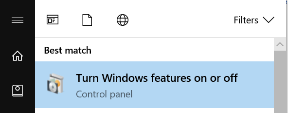
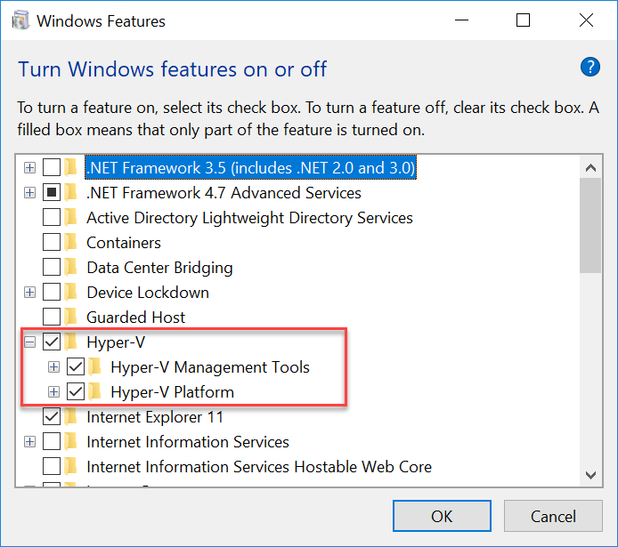
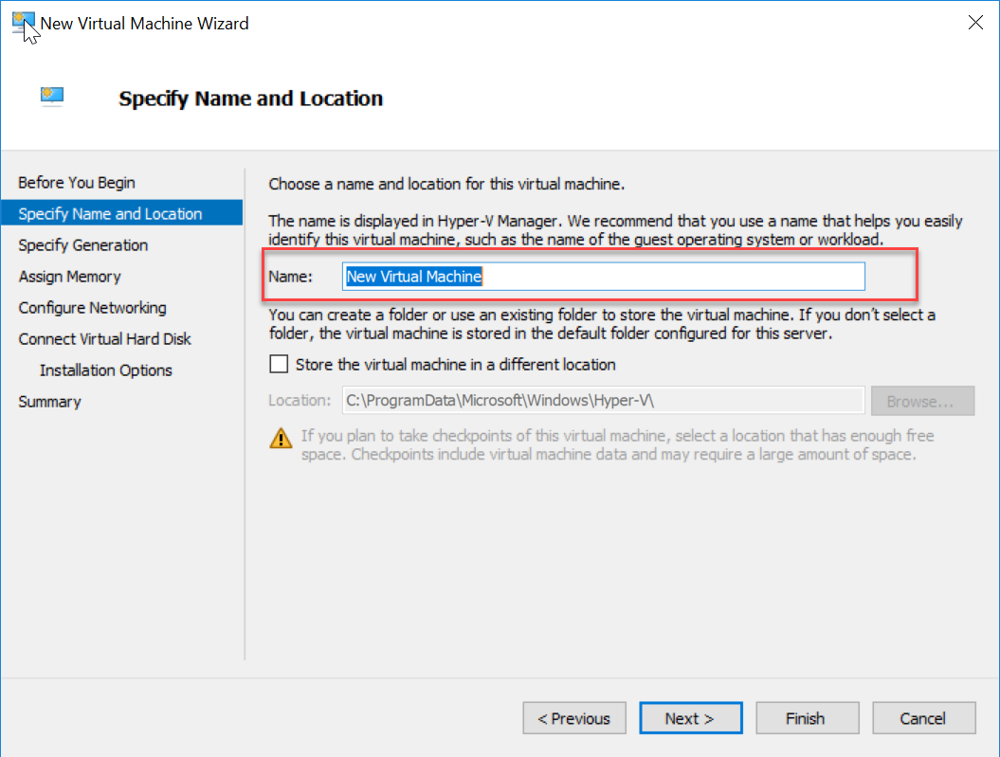
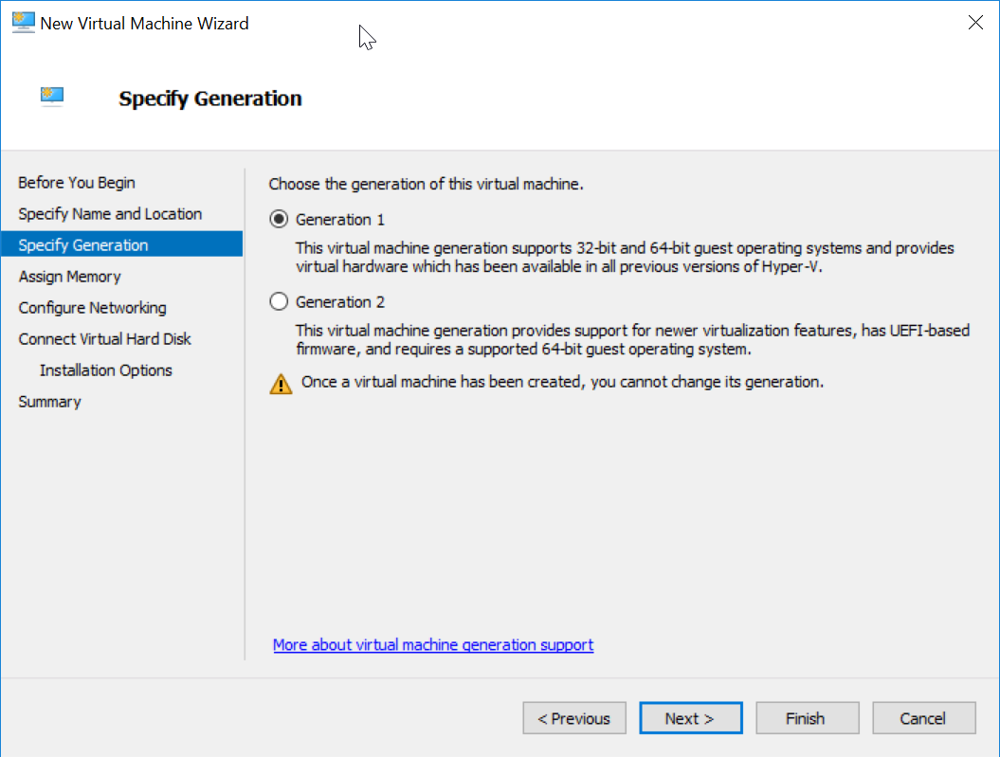
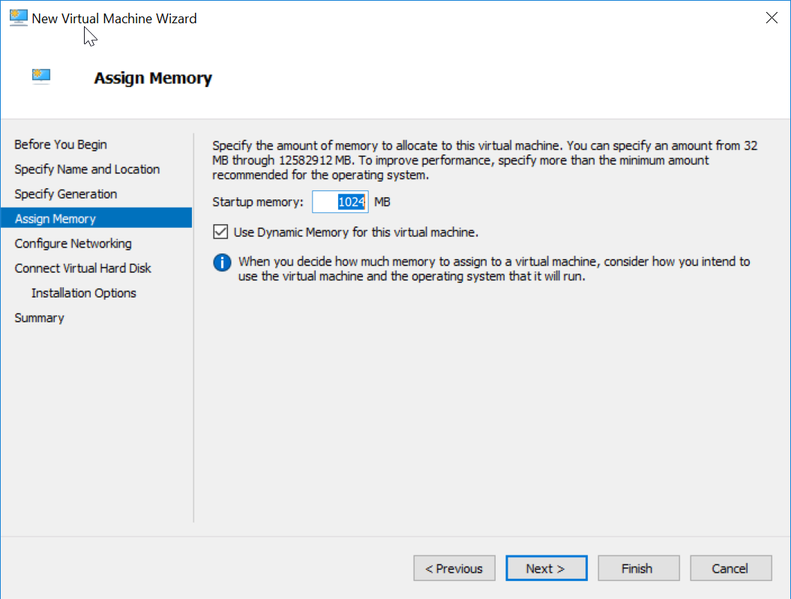
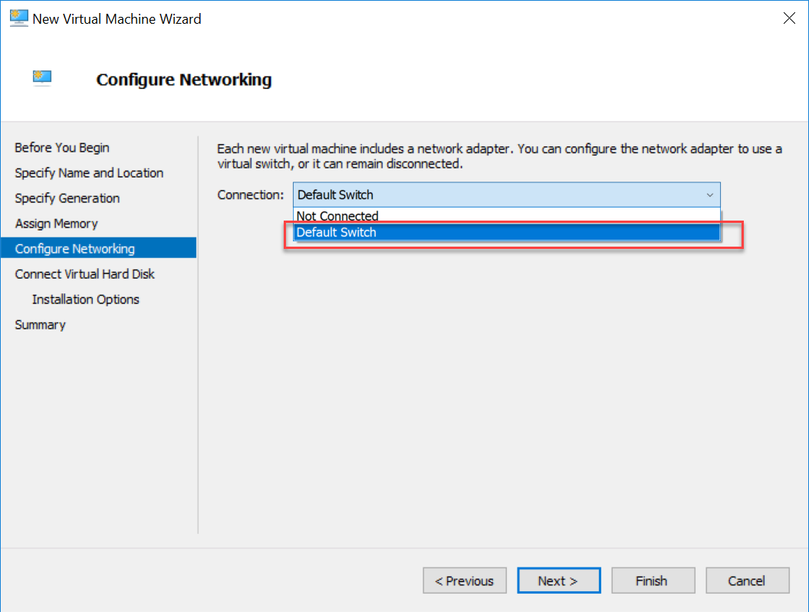
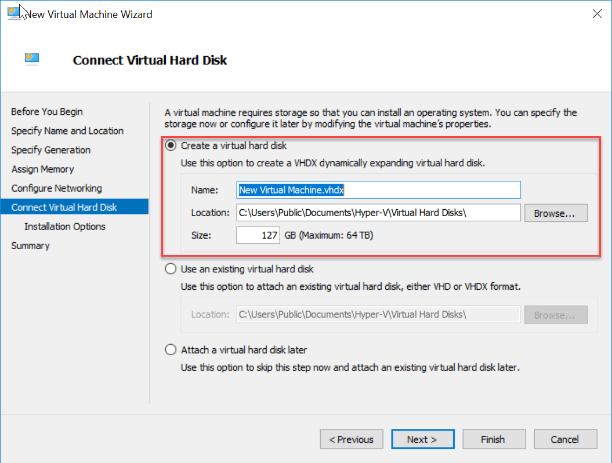
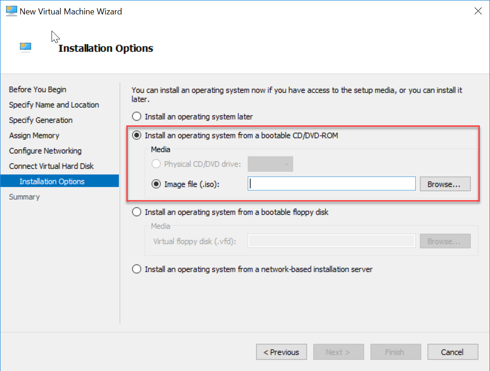

# Linux Development From a Windows Guy

I have always really liked my Windows machines, and for the longest time I stuck to it even when specific machine learning libraries weren't supported on Windows. About a year ago I finally gave in and started using Linux distribution for about a third of my data science work. In addition to being able to use more data science libraries, I have been deploying a lot of python code using Docker, which runs on Linux operating systems so I thought it would be better to develop using Linux as well. 

To be completely honest there are a ton of resources on the internet that walk you through setting up a Linux Hyper-V VM on windows (and probably better than this one), but I am writing a demo of a popular Auto ML library, MLBox, and it is not yet supported on Windows, therefore, this will serve as the first step of the demo. If you are interested in checking out the demo there is a [blog]() and step by step walk through on my [GitHub](https://github.com/ryanchynoweth44/AutoMLExamples).  

## Create a Linux Virtual Machine

1. My favorite way to work with Linux is to create a Hyper-V VM locally so that it is easy to connect to. To enable the Hyper-V open your start menu and search for "Turn Windows features on or off".   
 

1. Now scroll down to find "Hyper-V" and check the box next to it to enable.   

1. Now that Hyper-V is enable, we can create a virtual machine on our computer. First we will need to download a Linux distribution, I prefer [Ubuntu](https://www.ubuntu.com/download/desktop/thank-you?version=18.04.2&architecture=amd64). Note that this is download (~2GB) so downloading can take some time, and varies depending on your network speed.  

1. Once you have the `.iso` file we can create a virtual machine. In your start menu search for "Hyper-V Manager". 

1. In the Hyper-V manager navigate "New" > "Virtual Machine...". This will launch the start up wizard.   

1. For the most part in Wizard defaults will be acceptable. The first menu will have you provide the name of your virtual machine.  

1. The second menu will have you select the generation of the VM. We will want to use "Generation 1".  
 

1. Third we will need to allocate memory for your machine. The default of 1024 MB of Memory is fine, and we will also check the box to use "Dyanmic Memory".   

1. Next we will need configure the network access for the virtual machine. Simply select "Default Switch".  

1. Next we have the option to specify where we want to store our virtual machine hard disk. It is easiest to simply use the default locations. Note that the name of the Hard Disk will be determined by what you name your VM in the previous step.    

 

1. Now we simply need to select our Ubuntu `.iso` file we downloaded, and click Finish.   

1. This will launch the Ubuntu setup menu, and simply follow the instructions to create the virtual machine with your username and password.  