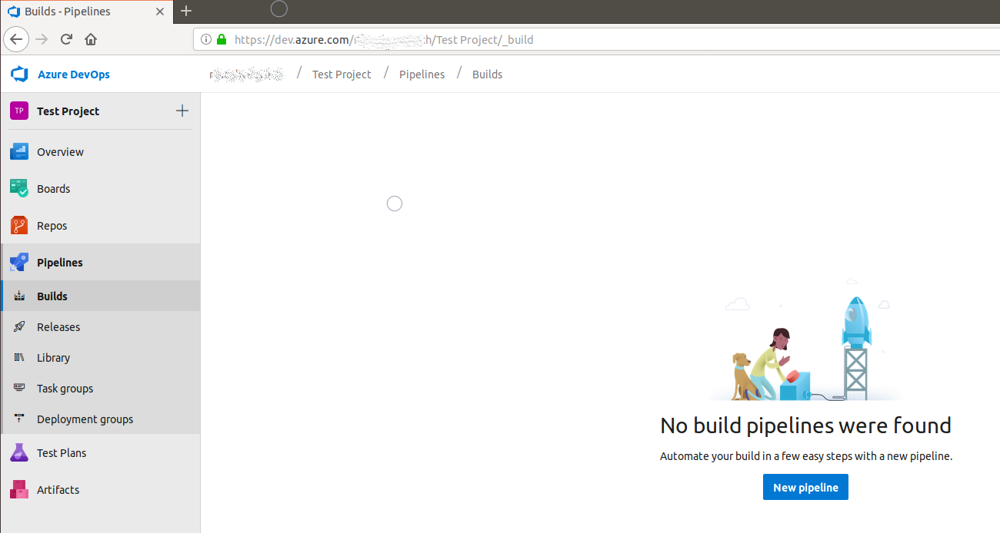
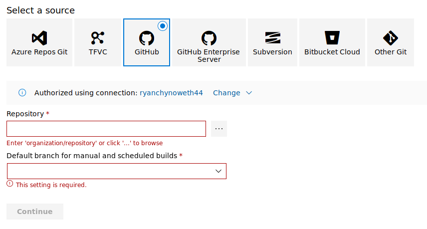
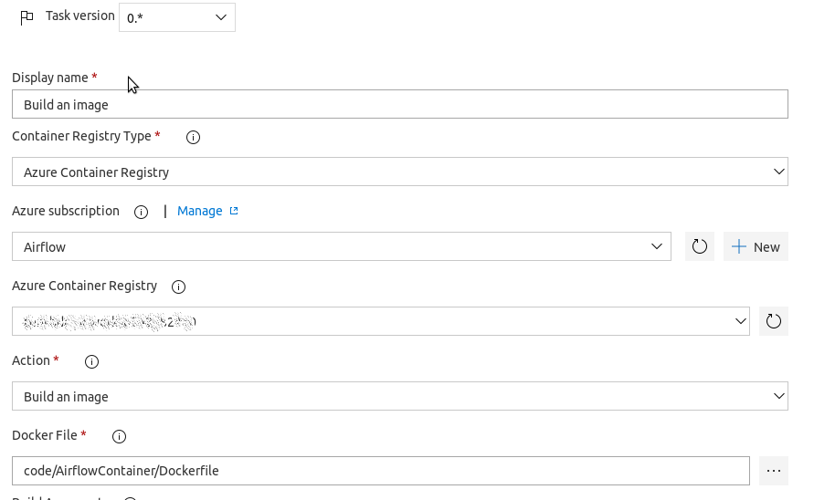
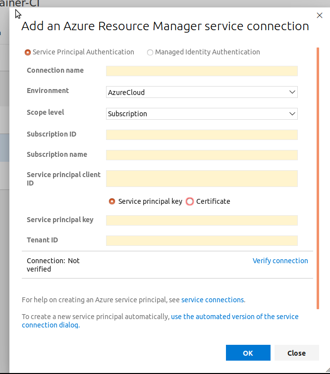
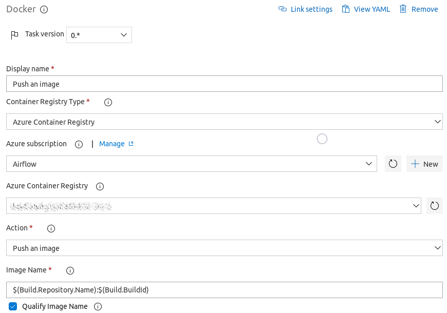
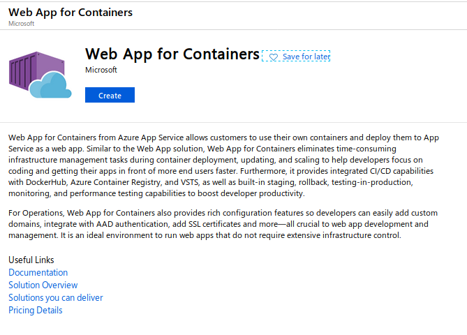
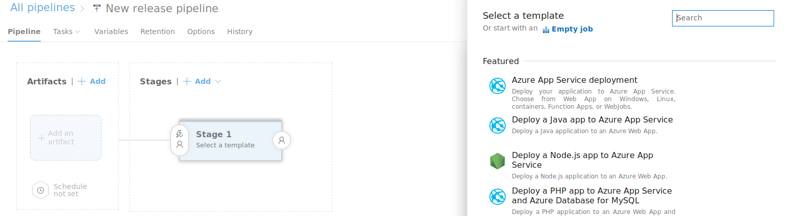

# Deploying Airflow Solutions in Azure

So far in this walkthrough we have developed and tested our DAGs locally by running airflow commands in the command line. Hopefully by now you have a solid understanding of some of the Apache Airflow capabilities and how to develop data solutions using it, but how do you get from your Ubuntu VM to production? My favorite way of deploying an Airflow solution is using [Docker](https://www.docker.com/). If you do not have it installed on your Ubuntu machine run `sudo apt install docker`.  

When deploying Apache Airflow with Docker the current standard image is `puckel/docker-airflow`, and the repository is available on [GitHub](https://github.com/puckel/docker-airflow). The main way that developers will use the `puckel/docker-airflow` image is to deploy the airflow application by following the instructions from GitHub README, then use docker volumes to persist the DAG files to the Docker containers. Volumes are a great way to manage your airflow DAGs because they easily allow users to test jobs on different environments and simply move the scripts from one volume to another to add it to the environment and get picked up by the airflow scheduler. We will walk through a Volume Deployment in the [next section](./07_DeployAirflowWithVolumes.md)

Another way to deploy Apache Airflow with `puckel/docker-airflow` is to add the DAG files to the container image creation. This would force developers to have a new version of the container each time you change a data pipeline. Lets start deploying airflow by adding our DAG to the Docker image build.


## Local Custom Docker Build for Airflow

1. In our `AirflowContainer` folder we need to create a `Dockerfile` to build our image. Paste the following into the `Dockerfile`.
    ```
    FROM puckel/docker-airflow

    ARG AIRFLOW_VERSION=1.10.2
    ARG AIRFLOW_HOME=/usr/local/airflow
    ARG AIRFLOW_DEPS=""
    ARG PYTHON_DEPS=""

    COPY /dags /usr/local/airflow/dags
    COPY requirements.txt /usr/local/airflow

    WORKDIR ${AIRFLOW_HOME}
    RUN pip install --user -r requirements.txt
    ```

    In this case we are starting with the standard `puckel/docker-airflow` airflow image, then we simply want to copy our DAGs and our custom requirements into the Airflow Home Direcory. Then once those files are copied over we will run a pip install using our `requirements.txt` file that we will create in the next step.  

1. Now we want to create our `requirements.txt` file with the following Azure dependencies. 
    ```
    azureml-sdk==1.0.39
    azure-datalake-store==0.0.45
    ```

1. The last file we need to create is a `docker-compose-LocalExecutor.yml` file that we will run to deploy and run our Docker container. You will notice that this file is pulled from the [`puckel/docker-airflow`](https://github.com/puckel/docker-airflow) with one change. 
    ```
    version: '2.1'
    services:
        postgres:
            image: postgres:9.6
            environment:
                - POSTGRES_USER=airflow
                - POSTGRES_PASSWORD=airflow
                - POSTGRES_DB=airflow

        webserver:
            #image: puckel/docker-airflow:1.10.2
            image: <THE_NAME_OF_YOUR_CUSTOM_DOCKER_CONTAINER_HERE>:lastest
            restart: always
            depends_on:
                - postgres
            environment:
                - LOAD_EX=n
                - EXECUTOR=Local
            volumes:
                - ./dags:/usr/local/airflow/dags
                # Uncomment to include custom plugins
                # - ./plugins:/usr/local/airflow/plugins
            ports:
                - "8080:8080"
            command: webserver
            healthcheck:
                test: ["CMD-SHELL", "[ -f /usr/local/airflow/airflow-webserver.pid ]"]
                interval: 30s
                timeout: 30s
                retries: 3
    ```

1. Now open a command prompt, navigate to the `AirflowContainer` directory, and run the following command to build your Docker container. 
    ```
    sudo docker build -t airflow_docker .
    ```

1. Let's run the newly created image locally on our machine. Just make sure that the image name is provided in your `docker-compose-LocalExecutor.yml`. 
    ```
    docker-compose -f docker-compose-LocalExecutor.yml up -d
    ```

1. Now check out your Airflow container running on [localhost:8080](http://localhost:8080)!


## Deploying our Container Using Azure Pipelines

We have built a container and ran it on our local machines. Lets try deploying our container to Azure Container Instance (ACI) using Azure DevOps. Please note that we are deploying to ACI for this demo, it is typically recommended users deploy to ACI for dev and test environments and use an Azure Kubernetes Service for production deployments. 

1. First, you will need an Azure DevOps Team Project. If you do not have a project available you can follow these [instructions](https://docs.microsoft.com/en-us/azure/devops/organizations/accounts/create-organization?view=azure-devops) to create an organization, please note the first 5 users are free. Then create an Azure DevOps Team Project by following these [instructions](https://docs.microsoft.com/en-us/azure/devops/organizations/projects/create-project). 

1. Once you have a team project you will need to commit your code to source control. There are a handful of options available to you, but I would recommend pushing your code to either GitHub or commiting it to an [Azure DevOps Git repository](https://docs.microsoft.com/en-us/azure/devops/repos/git/creatingrepo?view=azure-devops). I will be connecting my GitHub repository to my Azure DevOps account to deploy my code.    

1. Once your code is in a repository, we will create a build pipeline that builds our docker container and pushes it to our Azure Container Registry.   
    


1. Since my code is on GitHub I will select my repository source for GitHub, but as you can see Azure Pipelines can connect to practically any Git repository.  
    

1. Next we will use the Docker container build template.   
    

1. Select the "Build an Image" task in our build template. Provide the path to your Dockerfile in your repository. 
    

1. You will need to connect your Azure subscription as well by clicking the "+New" button. The image below shows how we can use the Service Principal Authentication connection with our existing values in our `app_config.conf` file, please provide values to connect. We will reuse the Azure Container Registry that was created when we deployed our Azure Machine Learning Web Service.  
    

1. Next we will want to push our image to Azure Container Registry so that we can deploy the image in our Release Pipeline. Simply provide the Azure Subscript and the Container Registry and leave default values for the rest of the fields.    
    


1. Click "Save & queue" at the top to run the build.  

1. Now we need to create a release. However, before we create a release naviagate the Azure Portal to create a new Web App Service.  
    

1. Create new release and select the "Azure App Service deployment template.  
    

