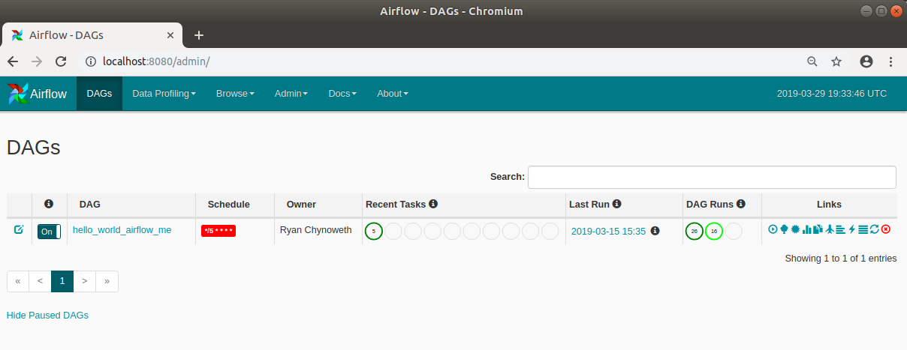

## Data Pipelines Using Airflow

I previously wrote a [blog and demo](https://ryansdataspot.com/2019/03/14/data-analytics-data-engineering-and-containers/) discussing how and why data engineers should deploy pipeliens using containers. One slight disadvantage to deploying data pipeline containers is managing, monitoring, and scheduling these can be a little bit of a pain. One of the most popular tools out their for solving this is [Apache Airflow](https://airflow.apache.org/). Apache Airflow is a platform to programmitcally develop, schedule, and monitor workflows. Workflows are defined as code, making them easy to maintain, test, deploy, and collaborate across a team. 

At the core of Apache Airflow are workflows that are represented as Directed Acyclic Graphs (DAGs) that are written mainly in Python or Bash commands. DAGs are made up of tasks that can be scheduled on a specific cadence, and can be monitored using the built in Airflow Webserver with an interface that looks like the following:

Generally, I suggest two methods of using Airflow for monitoring and scheduling purposes.  
1. DAG 
1. RESTful

Deploying data pipelines as DAGs makes it easy to deploy and set a schedule for your code to be executed. It is as easy as writing a Python script to extract, transform, or move data, and a script to create the DAG itself by importing the previous Python script into the DAG script. An example of this would be the [hello world example](./03_HelloWorld.md) I have provided. 

Deploying data pipelines as RESTful web services allows developers to decouple scheduling and data code by deploying a web service separate from your Apache Airflow deployment. Separate deployments would simply require a developer to write a DAG to call your web service on the schedule you wish. This is a great way to off load the compute and memory required to from your airflow server as well. The one draw back is that this adds a little more work to handle web service secrets but once it is handled it is easy to repeat and use across all your data pipelines. An example of this can be found with my [Restful deployment](./05_RestfulDeployment.md) example   

Overall, I have seen organizations develop home grown scheduling and monitoring techiniques in order to capture all the metadata required to ensure your data pipelines are running properly. Apache Airflow makes this process easy by offering a great built-in user interface to visualize your data pipelines, and provides a database for developers to build additional reporting as needed.   

